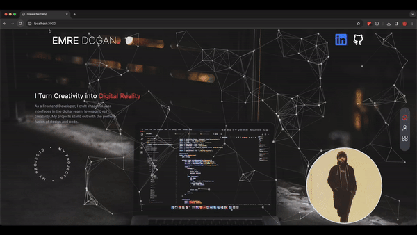

# My Next.js Web Site

This repository contains a web site built using Next.js. The project incorporates libraries such as [Framer Motion](https://www.framer.com/motion/) and [Swiper](https://swiperjs.com/) to enhance the user experience with animations and scrolling features.

## Features

- 🚀 **Framer Motion Animations**: Framer Motion library is used for page transitions and element animations.
- 🔄 **Swiper Integration**: Interactive scrolling elements are created using the Swiper library.
- 🎨 **Transition Effects**: Custom-designed transition effects are implemented for page transitions and other interactions.

## Go link: https://emre-dogan.vercel.app/

